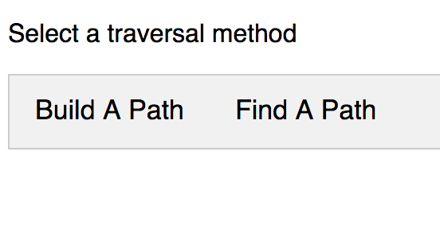
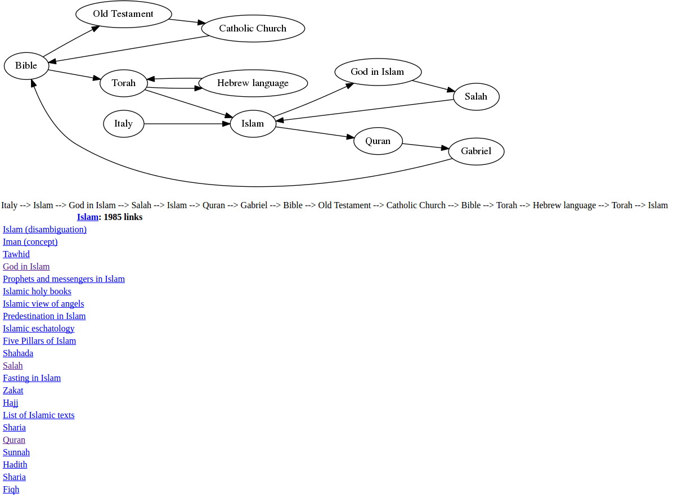

# Wikipedia Degrees of Separation


This project displays the degrees of separation between topics on Wikipedia. This interactive program allows users to visually see the shortest path between two topics. Users can select a start and end term from a dropdown menu, and the program will take them on the shortest journey between these topics through an automated process that clicks on the relevant Wikipedia links (see gif above).

Due to data storage limits and potentially long run-times, the program was implemented on a fully connected subset of articles, rather than all of Wikipedia. However, given more resources, the program can be easily scaled up to get the degrees of separation between any two topics on Wikipedia. 

To run this application, just run
```
$ server.py
```
in a terminal shell and open `localhost:5000` to interactively build or find a path between two topics.

## Project Description

The goal of this project is to create and measure a relationship in terms of degrees of separation between certain terms in Wikipedia. The degrees of separation between two Wikipedia search terms is defined by the number of clicks necessary to go from one article to the other, only using links within each subsequent Wikipedia page. This calculation is a proxy for “how closely related” those two search terms are. Two methods of traversal can be envisioned. The first is to start at a specific Wikipedia page, and iteratively navigate Wikipedia without knowing the final landing page. The user starts at a page and clicks links until he decides to stop. The second is to find a path between two pre-selected terms. The number of pages, minus one, in that path is the degrees of separation between the two terms.

In this project, we implemented both approaches to this problem. Each part of the project presents its own algorithmic, data storage, and data retrieval challenges that will be further discussed. The first option is called **Build a Path**, while the second is called **Find a Path**. Ultimately, the user has the choice of which traveral method he wishes to explore, and so he is given a choice right from the landing page of the server as shown below.



## Data Acquisition

### Overview of Available Options

For this project we require Wikipedia data. More specifically, we require _all_ of the Wikipedia search article titles and a list of all the links contained in each article. The Wikipedia English language dump is 15 GB compressed, so we have to be creative in our solution to acquire either a subset of articles or adopt a different methodology to get this data. We propose several solutions, their tests, and drawbacks.

1. The English language static html dump: “A copy of all pages from all Wikipedia wikis, in HTML form.” (14.3 GB as a .7z file)
2. Pywikibot: Python library that provides functionality to automate work on Wikipedia sites.
3. SQL interconnectedness files provided by Wikipedia: Files contain metadata on what links are found within every article.
4. CURL the urls for the article that is chosen on the fly: Iteratively get the list of links from a parsed HTML, and provide a choice of new articles to explore and build a navigation path.
5. Build a fully connected tree from a subset of articles: Limit the search options to terms included in the subset, but allow for full navigations between all articles (structured as parent and children nodes) to find the shortest path.

### Drawbacks and Advantages of Acquisition Options

1. The English language static html dump: This option was quickly discarded because, even though the dump was successfully stored in our local machines, it would have been impossible to host it on a publicly accessible server.
2. Pywikibot: Using a python library that provides functionality to work with Wikipedia pages seemed very reasonable since it seems like many people around the web are using it to update article content and give maintenance to content. Pywikibot allows 5,000 links to be scraped from a given Wikipedia page. Even though this seems like a viable solutions, we needed to make sure that the subset of articles is fully connected so there is always a path between any two nodes. Making sure the subset had this connectedness proved to be a difficult task, and one that Pywikibot could not accomplish on its own.
3. SQL interconnectedness files: This idea proved doable with a subset of data from the Philippines. We were able to download the files and search through the content in the file. We used a shortest path algorithm and were able to find the shortest path between any two terms. When using the full English interconnectedness files, however, storage again became the limiting factor because the English language full dump is 40GB.
4. CURL the urls for the article that is chosen on the fly: This was the viable solution for the data aquisition part of the **Build a Path** traversal method.
5. Build a fully connected tree from a subset of articles: Limit the search options to terms included in the subset, but allow for full navigations between all articles (structured as parent and children nodes) to find the shortest path.

The two methods that are used in the final implementation of this project are CURLing articles on the fly for the **Build a Path** method, and getting a subset of 400 fully-connected articles to build a traversable tree for the **Find a Path** method.

### CURL Solution for _Build a Path_

For this section, we use `urllib2` functions, specifically `urlopen()`. This allows us to open a network object for reading. To get the URL, we get the user-input term and send a request to constructed URL. To ensure functionality, we employ error handling in the URLs in the following manner:
```
def getLinksFromSearchString(searchString):
      searchURL = template_wikiURL % searchString
      URL = mainWikiURL % searchURL
      try:
            return getLinksFromURL(URL)
      except:
            return ["%s is not a valid search term" % searchString]
```

### Solution for List of Links

Given the difficulty of dealing with a data dump and the difficulty of using the python bot to extract information, we implement a script that does a request to a given URL and brings back the html to be parsed using BeautifulSoup. After the retrieval of the text, we look at all of the pieces of html containing a `mw-content-ltr` class tag. For example:
```
<div class="mw-content-ltr" dir="ltr" id="mw-content-text" lang="en">
<div class="hatnote" role="note">
This article is about artificial satellites. For natural satellites, also known as moons,
see <a href="/wiki/Natural_satellite" title="Natural satellite"> Natural satellite</a>
```

Once we obtain a link object, we look for the `a` anchor to get the actual `href`. We store that `(link, name)` pair in a python list to be utilized when the html is rendered. At this stage of the search it is necessary to check that the links returned are valid Wikipedia pages. To do this we use string properties to check whether the URL string starts with `wiki/` and also check for invalid characters. 

### Storing linked elements

Our first solution to store the connectedness of the articles was to use a linked list. This would allow us to begin with a node (which is the first search term as input from the user) and a pointer, which will reference the next node on the list. The next node on the list will then contain the name of the article that was clicked from that first list, and so on.

Although this method seems intuitive, it would not work for our purposes. In fact, we wish to store two pieces of information: the sequential list of articles visited, as well as how they connect with each other. If the user went back to a page that he previously visited, then the order of the visits would get lost. We therefore opted to keep two structures to store the information. First, a list of visited pages, where each subsequent page is appended to the list. Second, a dictionary of connected pages, where each key is associated with the article that it links to.

Another advatange of using a dictionary in this way is that it can easily be transformed into a directed graph text notation that can be passed to the command line’s `dot` function, which produces a graph image (that we display to the user), as shown below.



### Solution for Degrees of Separation and _Find a Path_

As opposed to the **Build a Path** section of the project, the **Find a Path** method needs to find the shortest path between two given terms that are user-input. This provides a challenging data acquisition project since to find a path from Article A to Article B, we need to ensure there is in a fact a way to get there using only links.

The proposed solution for this problem is the following:

1. Get a subset of 400 articles (Parent)
2. For each article, get 5 links contained in the article (Children), making sure that each Child links back to the Parent.
3. Create a traversable tree with 400 Parent nodes, each of which has 5 children that link back to the parent.

The limit of 400 articles is for both computational and storage purposes. Unlike the **Build a Path** part which gets data on the fly, the **Find a Path** section has all of the data pre-stored on disk and a set of functions that will traverse and find the nearest path between two terms. The tree is stored in a `.txt` file.

## Data types for storing hierarchical data

The traversable tree is stored as a sequential list of nodes. Because the tree is full, meaning every parent has a complete set of children, the traversal method is reliant only on the prior knowledge of how many children each parent has. The shortest path is calculated by first finding the paths of both the starting node back to the root and the ending node back to the root. These two paths must intersect at some point due to the full nature of the tree, so the path from start to intersection and then itersection to end is inherently the shortest path between the two.

## Journey through shortest path

As a visual bonus for the user, we have included a visual journey through the shortest path between two articles (view gif at the top). Harnessing _Selenium_, we can create a visual tour that mimics that shortest path and actually opens a browser window and shows each click that it would take to get from Article A to Article B.

## Encoding Issues

Given that some of the titles in the wikipedia articles contain non-ASCII and unicode characters, we had some encoding issues when displaying the links. However, we resolved this with a simple fix: we grabbed the link title text associated with each link, and used that to display the links instead. For example `Baden-W%C3%BCrttemberg` could be correctly displayed by grabbing the title associated with this `href` on Wikipedia, which was `title=“Baden-Württemberg”`.

## Other tools used

To get the list of links, we use **BeautifulSoup** to parse the html returned from our request to Wikipedia.

To provide the "journey" functionality, **Selenium** python bindings were utilized. These bindings provide API access to web-drivers or web browsers.

**Flask** is used to provide all of the functional bindings to turn functions into html. What Flask does is map a url to a python function. This allows us to set up event methods that are mapped to a particular URL.

# Bibliography

- Python Tree Data Sctructure. (n.d.). Retrieved from [http://stackoverflow.com/questions/3009935/looking-for-a-good-python-tree-data-structure](http://stackoverflow.com/questions/3009935/looking-for-a-good-python-tree-data-structure)
- Open Arbitrary Resources by URL. (n.d). Retrieved from [https://docs.python.org/2/library/urllib.html](https://docs.python.org/2/library/urllib.html)
- What are “CPU seconds?” (n.d.). Retrieved from [https://help.pythonanywhere.com/pages/WhatAreCPUSeconds](https://help.pythonanywhere.com/pages/WhatAreCPUSeconds)
- Data Structures. (n.d.). Retrieved from [https://docs.python.org/3/tutorial/datastructures.html](https://docs.python.org/3/tutorial/datastructures.html)
- Function to highlight links with Selenium. (n.d.). Based on code from [https://gist.github.com/dariodiaz/3104601](https://gist.github.com/dariodiaz/3104601)
